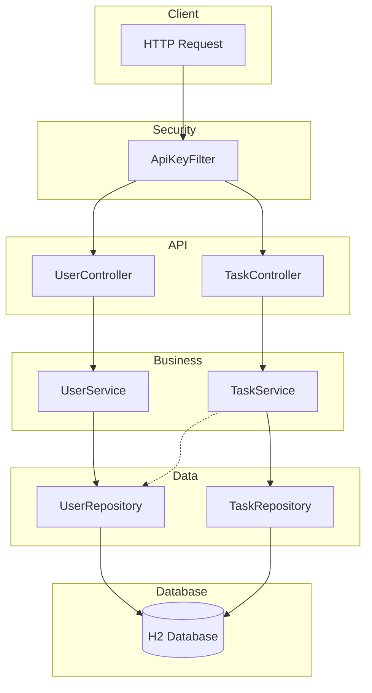
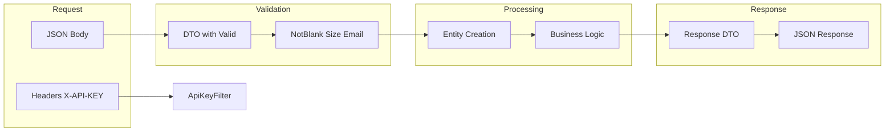
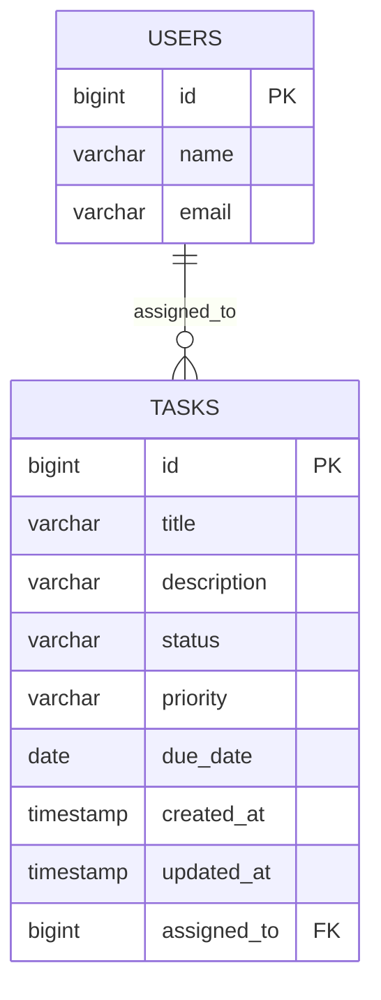
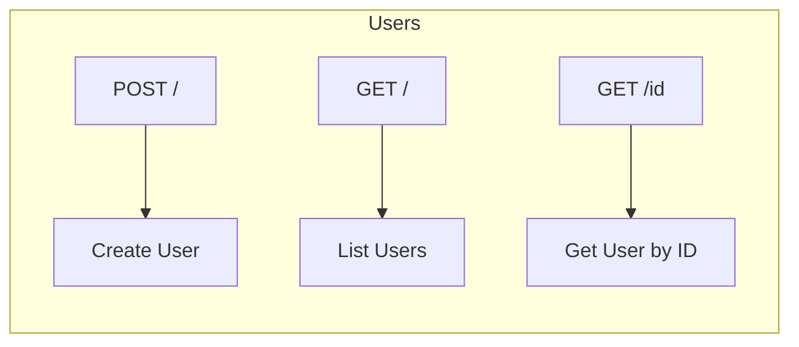
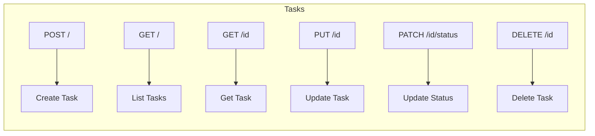
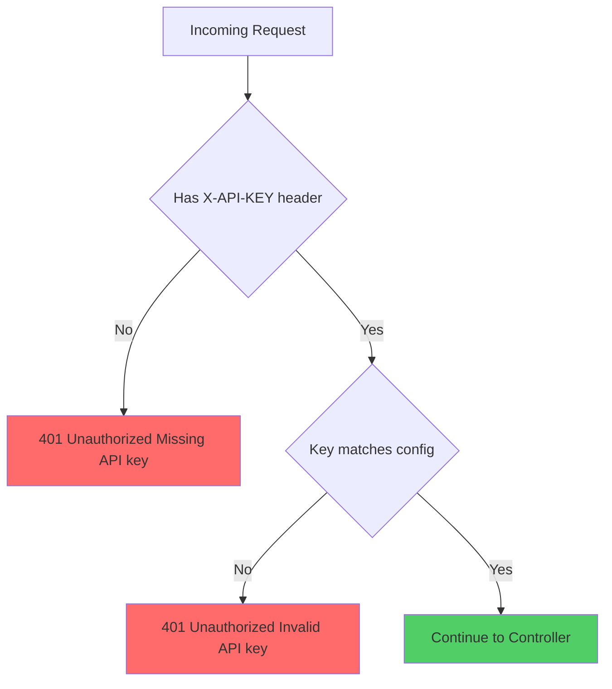
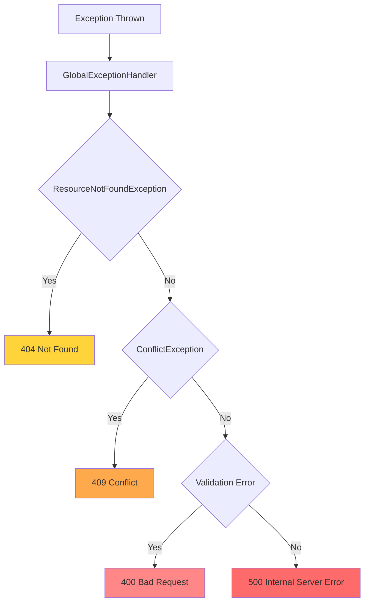

# Task Management REST API

A professional REST API for Task Management built with Spring Boot 3.2, JPA/Hibernate, and H2 Database.

---

## Table of Contents

- [Tech Stack](#tech-stack)
- [Architecture Overview](#architecture-overview)
- [How It Works](#how-it-works)
- [Project Structure](#project-structure)
- [Database Schema](#database-schema)
- [API Endpoints](#api-endpoints)
- [Request Flow](#request-flow)
- [Authentication](#authentication)
- [Error Handling](#error-handling)
- [Setup Instructions](#setup-instructions)
- [Sample Requests](#sample-requests)

---

## Tech Stack

| Technology | Purpose |
|------------|---------|
| Java 17 | Programming Language |
| Spring Boot 3.2.0 | Application Framework |
| Spring Data JPA | Database Access Layer |
| H2 Database | In-memory Database |
| Flyway | Database Migrations |
| Lombok | Boilerplate Reduction |
| Maven | Build Tool |

---

## Architecture Overview



### Layer Responsibilities

| Layer | Components | Responsibility |
|-------|------------|----------------|
| Security | ApiKeyFilter | Validates X-API-KEY header |
| Controller | UserController, TaskController | HTTP request/response handling |
| Service | UserService, TaskService | Business logic and validation |
| Repository | UserRepository, TaskRepository | Database operations |
| Entity | User, Task | Data models |

---

## How It Works

### Request Lifecycle


### Component Interaction Flow



---

## Project Structure

```
src/main/java/com/taskmanager/
├── TaskManagerApplication.java
│
├── config/
│   ├── ApiKeyFilter.java
│   └── SecurityConfig.java
│
├── controller/
│   ├── UserController.java
│   └── TaskController.java
│
├── dto/
│   ├── user/
│   │   ├── CreateUserRequest.java
│   │   └── UserResponse.java
│   └── task/
│       ├── CreateTaskRequest.java
│       ├── UpdateTaskRequest.java
│       ├── UpdateStatusRequest.java
│       └── TaskResponse.java
│
├── entity/
│   ├── User.java
│   └── Task.java
│
├── enums/
│   ├── TaskStatus.java
│   └── TaskPriority.java
│
├── exception/
│   ├── ResourceNotFoundException.java
│   ├── ConflictException.java
│   ├── ErrorResponse.java
│   └── GlobalExceptionHandler.java
│
├── repository/
│   ├── UserRepository.java
│   └── TaskRepository.java
│
└── service/
    ├── UserService.java
    └── TaskService.java
```

---

## Database Schema



### Migrations

| Version | File | Description |
|---------|------|-------------|
| V1 | V1__create_users_table.sql | Creates users table |
| V2 | V2__create_tasks_table.sql | Creates tasks table with FK |

---

## API Endpoints

### User Endpoints



| Method | Endpoint | Description | Status Codes |
|--------|----------|-------------|--------------|
| POST | /api/users | Create a new user | 201, 400, 409 |
| GET | /api/users | List all users paginated | 200 |
| GET | /api/users/{id} | Get user by ID | 200, 404 |

### Task Endpoints



| Method | Endpoint | Description | Status Codes |
|--------|----------|-------------|--------------|
| POST | /api/tasks | Create a new task | 201, 400, 404 |
| GET | /api/tasks | List tasks with filters | 200 |
| GET | /api/tasks/{id} | Get task by ID | 200, 404 |
| PUT | /api/tasks/{id} | Full update of task | 200, 400, 404 |
| PATCH | /api/tasks/{id}/status | Update status only | 200, 400, 404 |
| DELETE | /api/tasks/{id} | Delete task | 204, 404 |

### Query Parameters for GET /api/tasks

| Parameter | Type | Description |
|-----------|------|-------------|
| status | String | Filter by status TODO IN_PROGRESS DONE |
| priority | String | Filter by priority LOW MEDIUM HIGH |
| assignedToId | Long | Filter by assigned user ID |
| page | Integer | Page number default 0 |
| size | Integer | Page size default 10 |
| sort | String | Sort field default createdAt |

---

## Authentication

### API Key Flow



API Key: `taskmanager-secret-api-key-2024`

Header Format:
```
X-API-KEY: taskmanager-secret-api-key-2024
```

### Excluded Paths
- /h2-console/** - H2 Database Console

---

## Error Handling

### Error Response Structure

```json
{
  "timestamp": "2024-01-08T10:30:00",
  "status": 404,
  "error": "Not Found",
  "message": "Task not found with id: 10",
  "path": "/api/tasks/10"
}
```

### Exception Handling Flow



### HTTP Status Codes

| Code | Meaning | When Used |
|------|---------|-----------|
| 200 | OK | Successful GET PUT PATCH |
| 201 | Created | Successful POST |
| 204 | No Content | Successful DELETE |
| 400 | Bad Request | Validation errors |
| 401 | Unauthorized | Missing or Invalid API key |
| 404 | Not Found | Resource does not exist |
| 409 | Conflict | Duplicate email |
| 500 | Internal Server Error | Unexpected errors |

### Validation Error Response

```json
{
  "timestamp": "2024-01-08T10:30:00",
  "status": 400,
  "error": "Validation Failed",
  "errors": {
    "name": "Name is required",
    "email": "Email must be valid"
  },
  "path": "/api/users"
}
```

---

## Setup Instructions

### Prerequisites
- Java 17 or higher
- Maven 3.6+

### Clone Repository
```bash
git clone https://github.com/berserk3142-max/REST-API-for-a-Task-Management-system.git
cd REST-API-for-a-Task-Management-system
```

### Run Application
```bash
mvn spring-boot:run
```

Or build and run JAR:
```bash
mvn clean package
java -jar target/task-manager-1.0.0.jar
```

### Access Points
- API Base URL: http://localhost:8080/api
- H2 Console: http://localhost:8080/h2-console
  - JDBC URL: jdbc:h2:mem:taskdb
  - Username: sa
  - Password: empty

---

## Quick Start Testing Guide

> **⚠️ Important**: All API endpoints require the `X-API-KEY` header. Browsers cannot send custom headers, so use one of the methods below.

### API Key Information

| Key | Value |
|-----|-------|
| **Header Name** | `X-API-KEY` |
| **Header Value** | `taskmanager-secret-api-key-2024` |

---

### Method 1: PowerShell (Windows - Recommended)

#### Get All Users
```powershell
Invoke-RestMethod -Uri "http://localhost:8080/api/users" -Method GET -Headers @{"X-API-KEY"="taskmanager-secret-api-key-2024"} | ConvertTo-Json
```

#### Get All Tasks
```powershell
Invoke-RestMethod -Uri "http://localhost:8080/api/tasks" -Method GET -Headers @{"X-API-KEY"="taskmanager-secret-api-key-2024"} | ConvertTo-Json -Depth 5
```

#### Create a User
```powershell
Invoke-RestMethod -Uri "http://localhost:8080/api/users" -Method POST -ContentType "application/json" -Headers @{"X-API-KEY"="taskmanager-secret-api-key-2024"} -Body '{"name": "John Doe", "email": "john@example.com"}' | ConvertTo-Json
```

#### Create a Task
```powershell
Invoke-RestMethod -Uri "http://localhost:8080/api/tasks" -Method POST -ContentType "application/json" -Headers @{"X-API-KEY"="taskmanager-secret-api-key-2024"} -Body '{"title": "My Task", "description": "Task description", "status": "TODO", "priority": "HIGH", "dueDate": "2026-12-31", "assignedToId": 1}' | ConvertTo-Json -Depth 3
```

#### Update Task Status
```powershell
Invoke-RestMethod -Uri "http://localhost:8080/api/tasks/1/status" -Method PATCH -ContentType "application/json" -Headers @{"X-API-KEY"="taskmanager-secret-api-key-2024"} -Body '{"status": "IN_PROGRESS"}' | ConvertTo-Json -Depth 3
```

#### Delete a Task
```powershell
Invoke-RestMethod -Uri "http://localhost:8080/api/tasks/1" -Method DELETE -Headers @{"X-API-KEY"="taskmanager-secret-api-key-2024"}
```

#### Filter Tasks by Priority
```powershell
Invoke-RestMethod -Uri "http://localhost:8080/api/tasks?priority=HIGH" -Method GET -Headers @{"X-API-KEY"="taskmanager-secret-api-key-2024"} | ConvertTo-Json -Depth 5
```

#### Filter Tasks by Status
```powershell
Invoke-RestMethod -Uri "http://localhost:8080/api/tasks?status=TODO" -Method GET -Headers @{"X-API-KEY"="taskmanager-secret-api-key-2024"} | ConvertTo-Json -Depth 5
```

---

### Method 2: H2 Database Console (No API Key Required)

Access the database directly without API key:

1. **Open Browser**: http://localhost:8080/h2-console
2. **Login Credentials**:
   - JDBC URL: `jdbc:h2:mem:taskdb`
   - Username: `sa`
   - Password: *(leave empty)*
3. **Run SQL Queries**:
```sql
-- View all users
SELECT * FROM USERS;

-- View all tasks
SELECT * FROM TASKS;

-- View tasks with user details
SELECT t.*, u.name as user_name, u.email 
FROM TASKS t 
LEFT JOIN USERS u ON t.assigned_to = u.id;
```

---

### Method 3: Postman / Thunder Client

1. **Download**: [Postman](https://www.postman.com/downloads/) or use Thunder Client VS Code extension
2. **Add Header** to all requests:
   - Header Name: `X-API-KEY`
   - Header Value: `taskmanager-secret-api-key-2024`
3. **Set Content-Type** for POST/PUT/PATCH:
   - `Content-Type: application/json`

---

### Complete API Endpoints Reference

#### Users API

| Method | URL | Description | Body (JSON) |
|--------|-----|-------------|-------------|
| `GET` | http://localhost:8080/api/users | List all users | - |
| `GET` | http://localhost:8080/api/users/{id} | Get user by ID | - |
| `POST` | http://localhost:8080/api/users | Create new user | `{"name": "...", "email": "..."}` |

#### Tasks API

| Method | URL | Description | Body (JSON) |
|--------|-----|-------------|-------------|
| `GET` | http://localhost:8080/api/tasks | List all tasks | - |
| `GET` | http://localhost:8080/api/tasks/{id} | Get task by ID | - |
| `POST` | http://localhost:8080/api/tasks | Create new task | See below |
| `PUT` | http://localhost:8080/api/tasks/{id} | Full update task | See below |
| `PATCH` | http://localhost:8080/api/tasks/{id}/status | Update status only | `{"status": "TODO\|IN_PROGRESS\|DONE"}` |
| `DELETE` | http://localhost:8080/api/tasks/{id} | Delete task | - |

#### Task Filter Parameters (GET /api/tasks)

| Parameter | Values | Example |
|-----------|--------|---------|
| `status` | `TODO`, `IN_PROGRESS`, `DONE` | `?status=TODO` |
| `priority` | `LOW`, `MEDIUM`, `HIGH` | `?priority=HIGH` |
| `assignedToId` | User ID (number) | `?assignedToId=1` |
| `page` | Page number (0-based) | `?page=0` |
| `size` | Items per page | `?size=10` |

#### Sample Request Bodies

**Create/Update Task:**
```json
{
  "title": "Task Title",
  "description": "Task Description",
  "status": "TODO",
  "priority": "HIGH",
  "dueDate": "2026-12-31",
  "assignedToId": 1
}
```

**Create User:**
```json
{
  "name": "John Doe",
  "email": "john@example.com"
}
```

**Update Status:**
```json
{
  "status": "IN_PROGRESS"
}
```

---

## Sample Requests

### Create User
```bash
curl -X POST http://localhost:8080/api/users \
  -H "Content-Type: application/json" \
  -H "X-API-KEY: taskmanager-secret-api-key-2024" \
  -d '{
    "name": "John Doe",
    "email": "john@example.com"
  }'
```

Response 201 Created:
```json
{
  "id": 1,
  "name": "John Doe",
  "email": "john@example.com"
}
```

### Create Task
```bash
curl -X POST http://localhost:8080/api/tasks \
  -H "Content-Type: application/json" \
  -H "X-API-KEY: taskmanager-secret-api-key-2024" \
  -d '{
    "title": "Complete API documentation",
    "description": "Write comprehensive API docs",
    "status": "TODO",
    "priority": "HIGH",
    "dueDate": "2024-12-31",
    "assignedToId": 1
  }'
```

Response 201 Created:
```json
{
  "id": 1,
  "title": "Complete API documentation",
  "description": "Write comprehensive API docs",
  "status": "TODO",
  "priority": "HIGH",
  "dueDate": "2024-12-31",
  "createdAt": "2024-01-08T10:30:00",
  "updatedAt": "2024-01-08T10:30:00",
  "assignedTo": {
    "id": 1,
    "name": "John Doe",
    "email": "john@example.com"
  }
}
```

### Get Tasks with Filters
```bash
curl "http://localhost:8080/api/tasks?status=TODO&priority=HIGH&page=0&size=10" \
  -H "X-API-KEY: taskmanager-secret-api-key-2024"
```

### Update Task Status
```bash
curl -X PATCH http://localhost:8080/api/tasks/1/status \
  -H "Content-Type: application/json" \
  -H "X-API-KEY: taskmanager-secret-api-key-2024" \
  -d '{"status": "IN_PROGRESS"}'
```

### Delete Task
```bash
curl -X DELETE http://localhost:8080/api/tasks/1 \
  -H "X-API-KEY: taskmanager-secret-api-key-2024"
```

---

## Design Decisions

| Decision | Rationale |
|----------|-----------|
| DTOs over Entities | Prevents entity exposure and over-posting vulnerabilities |
| Service Layer | Separates business logic from controllers for testability |
| Global Exception Handler | Consistent error responses across all endpoints |
| API Key Authentication | Simple but effective for assignment requirements |
| Flyway Migrations | Version-controlled database schema changes |
| H2 In-Memory DB | Easy development setup no external dependencies |

---

## License

This project is for educational purposes.
