# Task Management REST API

A professional REST API for Task Management built with **Spring Boot 3.2**, **JPA/Hibernate**, and **H2 Database**.

---

## 📋 Table of Contents

- [Tech Stack](#tech-stack)
- [Architecture Overview](#architecture-overview)
- [How It Works](#how-it-works)
- [Project Structure](#project-structure)
- [Database Schema](#database-schema)
- [API Endpoints](#api-endpoints)
- [Request Flow](#request-flow)
- [Authentication](#authentication)
- [Error Handling](#error-handling)
- [Setup Instructions](#setup-instructions)
- [Sample Requests](#sample-requests)

---

## 🛠️ Tech Stack

| Technology | Purpose |
|------------|---------|
| Java 17 | Programming Language |
| Spring Boot 3.2.0 | Application Framework |
| Spring Data JPA | Database Access Layer |
| H2 Database | In-memory Database (Dev) |
| Flyway | Database Migrations |
| Lombok | Boilerplate Reduction |
| Maven | Build Tool |

---

## 🏗️ Architecture Overview

```mermaid
flowchart TB
    subgraph Client["🌐 Client Layer"]
        HTTP["HTTP Request"]
    end

    subgraph Security["🔐 Security Layer"]
        Filter["ApiKeyFilter"]
    end

    subgraph API["📡 API Layer"]
        UC["UserController"]
        TC["TaskController"]
    end

    subgraph Business["⚙️ Business Layer"]
        US["UserService"]
        TS["TaskService"]
    end

    subgraph Data["💾 Data Layer"]
        UR["UserRepository"]
        TR["TaskRepository"]
    end

    subgraph Database["🗄️ Database"]
        DB[("H2 Database")]
    end

    HTTP --> Filter
    Filter --> UC
    Filter --> TC
    UC --> US
    TC --> TS
    US --> UR
    TS --> TR
    TS -.-> UR
    UR --> DB
    TR --> DB
```



### Layer Responsibilities

| Layer | Components | Responsibility |
|-------|------------|----------------|
| **Security** | ApiKeyFilter | Validates X-API-KEY header |
| **Controller** | UserController, TaskController | HTTP request/response handling |
| **Service** | UserService, TaskService | Business logic & validation |
| **Repository** | UserRepository, TaskRepository | Database operations |
| **Entity** | User, Task | Data models |

---

## ⚡ How It Works

### Request Lifecycle


### Component Interaction Flow

```mermaid
flowchart LR
    subgraph Request["📥 Incoming Request"]
        JSON["JSON Body"]
        Headers["Headers (X-API-KEY)"]
    end

    subgraph Validation["✅ Validation"]
        DTO["DTO with @Valid"]
        Anno["@NotBlank, @Size, @Email"]
    end

    subgraph Processing["⚙️ Processing"]
        Entity["Entity Creation"]
        Logic["Business Logic"]
    end

    subgraph Response["📤 Response"]
        ResDTO["Response DTO"]
        ResJSON["JSON Response"]
    end

    JSON --> DTO
    Headers --> Filter["ApiKeyFilter"]
    DTO --> Anno
    Anno --> Entity
    Entity --> Logic
    Logic --> ResDTO
    ResDTO --> ResJSON
```



---

## 📁 Project Structure

```
src/main/java/com/taskmanager/
├── TaskManagerApplication.java     # Main entry point
│
├── config/
│   ├── ApiKeyFilter.java          # X-API-KEY validation filter
│   └── SecurityConfig.java        # Filter registration
│
├── controller/
│   ├── UserController.java        # /api/users endpoints
│   └── TaskController.java        # /api/tasks endpoints
│
├── dto/
│   ├── user/
│   │   ├── CreateUserRequest.java # Input DTO for creating user
│   │   └── UserResponse.java      # Output DTO for user data
│   └── task/
│       ├── CreateTaskRequest.java # Input DTO for creating task
│       ├── UpdateTaskRequest.java # Input DTO for updating task
│       ├── UpdateStatusRequest.java # Input DTO for status update
│       └── TaskResponse.java      # Output DTO for task data
│
├── entity/
│   ├── User.java                  # User JPA entity
│   └── Task.java                  # Task JPA entity
│
├── enums/
│   ├── TaskStatus.java            # TODO, IN_PROGRESS, DONE
│   └── TaskPriority.java          # LOW, MEDIUM, HIGH
│
├── exception/
│   ├── ResourceNotFoundException.java  # 404 errors
│   ├── ConflictException.java          # 409 errors
│   ├── ErrorResponse.java              # Error response structure
│   └── GlobalExceptionHandler.java     # Central exception handler
│
├── repository/
│   ├── UserRepository.java        # User database operations
│   └── TaskRepository.java        # Task database operations
│
└── service/
    ├── UserService.java           # User business logic
    └── TaskService.java           # Task business logic
```

---

## 🗄️ Database Schema


### Migrations

| Version | File | Description |
|---------|------|-------------|
| V1 | `V1__create_users_table.sql` | Creates users table |
| V2 | `V2__create_tasks_table.sql` | Creates tasks table with FK |

---

## 📡 API Endpoints

### User Endpoints


| Method | Endpoint | Description | Status Codes |
|--------|----------|-------------|--------------|
| POST | `/api/users` | Create a new user | 201, 400, 409 |
| GET | `/api/users` | List all users (paginated) | 200 |
| GET | `/api/users/{id}` | Get user by ID | 200, 404 |

### Task Endpoints


| Method | Endpoint | Description | Status Codes |
|--------|----------|-------------|--------------|
| POST | `/api/tasks` | Create a new task | 201, 400, 404 |
| GET | `/api/tasks` | List tasks with filters | 200 |
| GET | `/api/tasks/{id}` | Get task by ID | 200, 404 |
| PUT | `/api/tasks/{id}` | Full update of task | 200, 400, 404 |
| PATCH | `/api/tasks/{id}/status` | Update status only | 200, 400, 404 |
| DELETE | `/api/tasks/{id}` | Delete task | 204, 404 |

### Query Parameters for GET /api/tasks

| Parameter | Type | Description |
|-----------|------|-------------|
| `status` | String | Filter by status (TODO, IN_PROGRESS, DONE) |
| `priority` | String | Filter by priority (LOW, MEDIUM, HIGH) |
| `assignedToId` | Long | Filter by assigned user ID |
| `page` | Integer | Page number (default: 0) |
| `size` | Integer | Page size (default: 10) |
| `sort` | String | Sort field (default: createdAt) |

---

## 🔒 Authentication

### API Key Flow


**API Key**: `taskmanager-secret-api-key-2024`

**Header Format**:
```
X-API-KEY: taskmanager-secret-api-key-2024
```

### Excluded Paths
- `/h2-console/**` - H2 Database Console (for development)

---

## ⚠️ Error Handling

### Error Response Structure

```json
{
  "timestamp": "2024-01-08T10:30:00",
  "status": 404,
  "error": "Not Found",
  "message": "Task not found with id: 10",
  "path": "/api/tasks/10"
}
```

### Exception Handling Flow


### HTTP Status Codes

| Code | Meaning | When Used |
|------|---------|-----------|
| 200 | OK | Successful GET, PUT, PATCH |
| 201 | Created | Successful POST |
| 204 | No Content | Successful DELETE |
| 400 | Bad Request | Validation errors |
| 401 | Unauthorized | Missing/Invalid API key |
| 404 | Not Found | Resource doesn't exist |
| 409 | Conflict | Duplicate email |
| 500 | Internal Server Error | Unexpected errors |

### Validation Error Response

```json
{
  "timestamp": "2024-01-08T10:30:00",
  "status": 400,
  "error": "Validation Failed",
  "errors": {
    "name": "Name is required",
    "email": "Email must be valid"
  },
  "path": "/api/users"
}
```

---

## 🚀 Setup Instructions

### Prerequisites
- **Java 17** or higher
- **Maven 3.6+**

### Clone Repository
```bash
git clone https://github.com/berserk3142-max/REST-API-for-a-Task-Management-system.git
cd REST-API-for-a-Task-Management-system
```

### Run Application
```bash
# Using Maven
mvn spring-boot:run

# Or build and run JAR
mvn clean package
java -jar target/task-manager-1.0.0.jar
```

### Access Points
- **API Base URL**: `http://localhost:8080/api`
- **H2 Console**: `http://localhost:8080/h2-console`
  - JDBC URL: `jdbc:h2:mem:taskdb`
  - Username: `sa`
  - Password: (empty)

---

## 📝 Sample Requests

### Create User
```bash
curl -X POST http://localhost:8080/api/users \
  -H "Content-Type: application/json" \
  -H "X-API-KEY: taskmanager-secret-api-key-2024" \
  -d '{
    "name": "John Doe",
    "email": "john@example.com"
  }'
```

**Response (201 Created)**:
```json
{
  "id": 1,
  "name": "John Doe",
  "email": "john@example.com"
}
```

### Create Task
```bash
curl -X POST http://localhost:8080/api/tasks \
  -H "Content-Type: application/json" \
  -H "X-API-KEY: taskmanager-secret-api-key-2024" \
  -d '{
    "title": "Complete API documentation",
    "description": "Write comprehensive API docs",
    "status": "TODO",
    "priority": "HIGH",
    "dueDate": "2024-12-31",
    "assignedToId": 1
  }'
```

**Response (201 Created)**:
```json
{
  "id": 1,
  "title": "Complete API documentation",
  "description": "Write comprehensive API docs",
  "status": "TODO",
  "priority": "HIGH",
  "dueDate": "2024-12-31",
  "createdAt": "2024-01-08T10:30:00",
  "updatedAt": "2024-01-08T10:30:00",
  "assignedTo": {
    "id": 1,
    "name": "John Doe",
    "email": "john@example.com"
  }
}
```

### Get Tasks with Filters
```bash
curl "http://localhost:8080/api/tasks?status=TODO&priority=HIGH&page=0&size=10" \
  -H "X-API-KEY: taskmanager-secret-api-key-2024"
```

### Update Task Status
```bash
curl -X PATCH http://localhost:8080/api/tasks/1/status \
  -H "Content-Type: application/json" \
  -H "X-API-KEY: taskmanager-secret-api-key-2024" \
  -d '{"status": "IN_PROGRESS"}'
```

### Delete Task
```bash
curl -X DELETE http://localhost:8080/api/tasks/1 \
  -H "X-API-KEY: taskmanager-secret-api-key-2024"
```

---

## 🎯 Design Decisions

| Decision | Rationale |
|----------|-----------|
| **DTOs over Entities** | Prevents entity exposure and over-posting vulnerabilities |
| **Service Layer** | Separates business logic from controllers for testability |
| **Global Exception Handler** | Consistent error responses across all endpoints |
| **API Key Authentication** | Simple but effective for assignment requirements |
| **Flyway Migrations** | Version-controlled database schema changes |
| **H2 In-Memory DB** | Easy development setup, no external dependencies |

---

## 📄 License

This project is for educational/assignment purposes.
